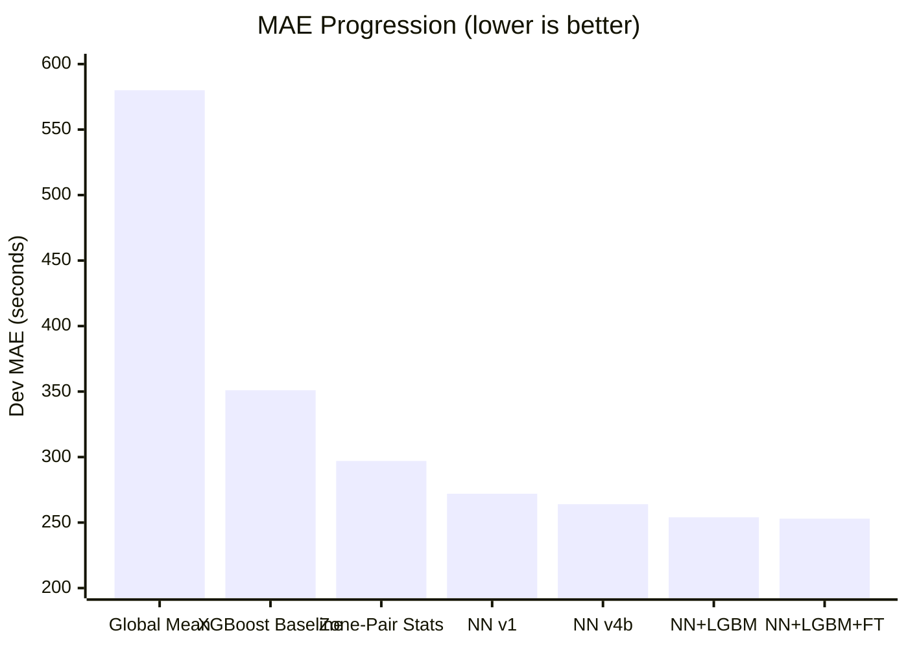
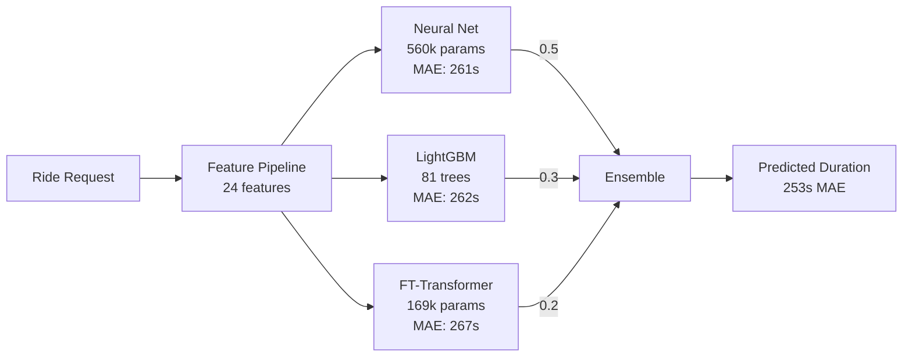
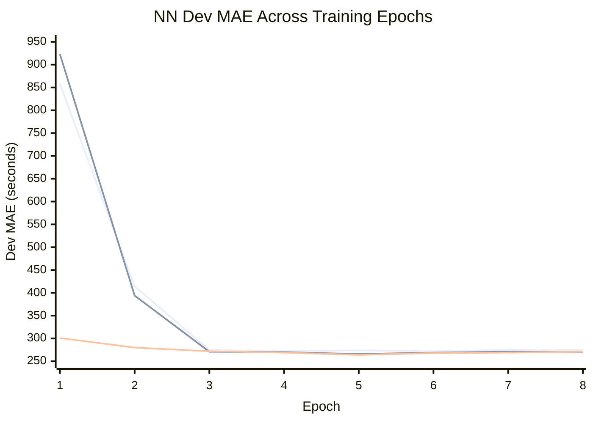
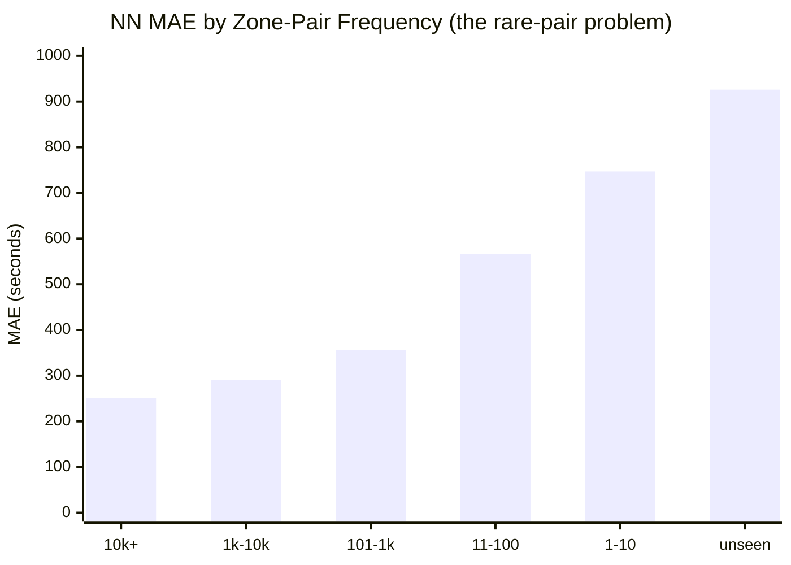
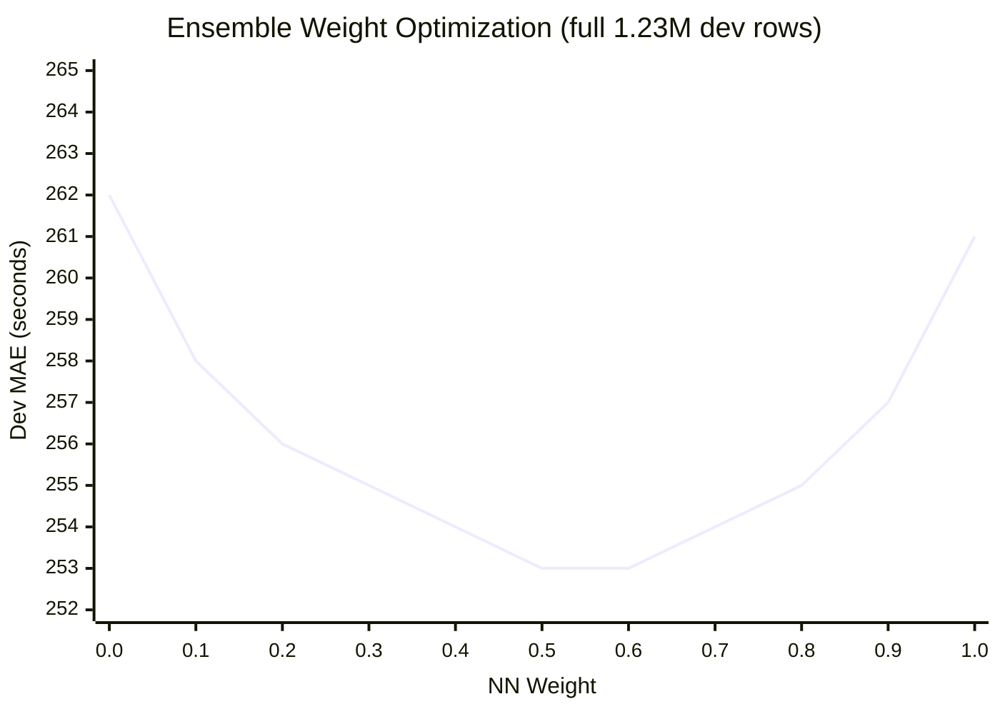

# NYC ETA Engine

**Dev MAE: 253s** | 3-model ensemble | 28% below baseline

Predicting NYC taxi trip duration from pickup/dropoff zones, request
timestamp, and passenger count.

[Try it live on Colab](https://colab.research.google.com/) | [Pre-trained models on HuggingFace](https://huggingface.co/sarthakbiswas/eta-engine)

---

## The Result



| Method | Dev MAE | vs Baseline |
|--------|---------|-------------|
| XGBoost baseline (challenge) | 351s | -- |
| Zone-pair median (no ML) | 297s | -15% |
| Neural net v4b (best single) | 264s | -25% |
| **3-model ensemble** | **253s** | **-28%** |

---

## How It Works



### Why Three Models?

Each model makes **different mistakes**. That's the whole point.

| Model | What it does well | Where it fails | Bias |
|-------|------------------|----------------|------|
| **NN** | Smooth interpolation for common routes | Underpredicts rare/long trips | -106s |
| **LightGBM** | Hard partitions on zone IDs, handles rare pairs | Less precise on common routes | -6s |
| **FT-Transformer** | Cross-feature attention, different error pattern | Weaker standalone | -1s |
| **Ensemble** | -- | -- | **-43s** |

The NN's -106s bias and LGBM's -6s bias partially cancel. The FT-Transformer's
near-zero bias adds further diversity. Blending three uncorrelated error
patterns gives 253s -- 8s better than the best single model.

---

## The Journey

### Phase 1: Understanding the Data

**Key insight:** Zone-pair median (297s) beats XGBoost (351s) with zero ML.

The dominant signal is the pickup-dropoff pair itself. A trip from zone 236 to
237 takes ~600s regardless of model complexity. Everything else -- time of day,
day of week, passenger count -- is refinement on top.

This motivated Bayesian-shrunk zone-pair statistics as the foundation feature.

### Phase 1b: Feature Engineering -- Turning Raw Data Into Signal

The raw dataset is 37M rows with just 4 fields: `pickup_zone`, `dropoff_zone`,
`requested_at`, `passenger_count`. Duration is the target. Everything else must
be engineered.

**Zone-Pair Statistics (14 features)**

Computed per (pickup, dropoff) pair from the 37M training rows:

| Feature | What it captures | Example |
|---------|-----------------|---------|
| `pair_mean_smoothed` | Bayesian-shrunk average duration | Zone 236->237: 612s |
| `pair_median` | Robust central estimate | 584s |
| `pair_std`, `pair_iqr` | Route variability | High std = unpredictable route |
| `pair_p25`, `pair_p75` | Duration range | Short vs long trip bounds |
| `pair_tb_mean`, `pair_tb_median` | Time-bucketed duration (6 buckets) | 5AM: 251s vs 2PM: 552s |
| `pair_rarity` | 1/(1+log1p(count)) | 1.0 for unseen, 0.08 for common |
| `pu_mean`, `do_mean` | Zone-level averages | Fallback for unseen pairs |

**Bayesian Shrinkage:** Pairs with few trips (e.g., 3 trips) have noisy
statistics. We shrink their mean toward the pickup-zone prior using
`smoothed = (n * pair_mean + 20 * zone_mean) / (n + 20)`. This prevents
overfitting to sparse data -- 44,697 unique pairs, many with <10 trips.

**Time Bucketing (6 traffic regimes):**

| Bucket | Hours | Regime |
|--------|-------|--------|
| 0 | 12AM-5AM | Late night |
| 1 | 5AM-8AM | Early morning |
| 2 | 8AM-11AM | AM rush |
| 3 | 11AM-4PM | Midday |
| 4 | 4PM-8PM | PM rush |
| 5 | 8PM-12AM | Evening |

The same zone pair varies **2.2x by time of day**. Time-bucketed means capture
this with Bayesian shrinkage toward the overall pair mean (prior_count=10).

**Fallback Hierarchy for Unseen Pairs:**
```
pair-level stats -> pickup-zone mean -> dropoff-zone mean -> global mean
```
492 dev rows have zone pairs never seen in training. The hierarchy ensures
they still get reasonable predictions.

**Temporal Features (10 features)**

Cyclical sin/cos encoding for hour, day-of-week, month. Binary flags for
weekend, rush hour (weekday 7-9AM, 4-7PM), and night (11PM-5AM). Normalized
minute-of-day.

**Memory-Efficient Processing:**

37M rows x 24 features doesn't fit in memory on Kaggle's 13GB RAM. The
pipeline processes data in 2M-row chunks, using integer-encoded pair keys
(pickup*1000 + dropoff) instead of tuple objects to avoid Python object
overhead (~3-4GB savings).

### Phase 2: Neural Net Iteration (272s -> 264s)

Built a tabular NN with learned zone embeddings and iterated through 4 versions.
Each version was motivated by error analysis of the previous one.



| Version | Change | Dev MAE | Why |
|---------|--------|---------|-----|
| v1 | Baseline NN, L1 loss | 272s | Zone embeddings + temporal features |
| v2 | Huber loss + 5 new features | 266s | Time-bucketed zone-pair stats, error analysis showed underprediction |
| v3 | Residual blocks + embedding interactions | 264s | `pu*do` (similarity) + `pu-do` (directionality) |
| v4b | Lower dropout (0.3->0.15) + pair_rarity | 264s | Diagnostic showed 66s dropout noise was excessive |

**Key pattern:** All versions converge by epoch 3-4, then overfit. The gap
narrows with each version -- architecture was hitting diminishing returns.

### Phase 3: The Diagnostic That Changed Everything

Stuck at 264s, I ran deep diagnostics instead of tuning blindly.

**Finding: error is dominated by rare zone pairs.**



| Pair Frequency | Rows | MAE | Bias | Avg Duration |
|---------------|------|-----|------|-------------|
| 10k+ trips | 875k | 251s | -42s | 849s |
| 1k-10k | 286k | 291s | -8s | 1278s |
| 101-1k | 47k | 356s | -23s | 1524s |
| 11-100 | 17k | 566s | -112s | 2031s |
| 1-10 | 5k | 747s | -243s | 2595s |
| unseen | 492 | 926s | -436s | 2829s |

**The NN is already near-optimal for common routes (251s).** The error lives
in the long tail -- rare pairs where embeddings have nothing to interpolate
from. No architecture change can fix this. A fundamentally different model is
needed.

### Phase 4: Ensemble Breaks Through (264s -> 253s)

**LightGBM** solved the rare-pair problem. Trees use zone IDs as native
categoricals -- they partition rather than interpolate. Bias dropped from
-106s to -6s.

**FT-Transformer** (built from scratch following the NeurIPS 2021 paper) added
further diversity. Self-attention discovers cross-feature interactions without
hand-designed branches.



### Phase 5: Inference Optimization

The FT-Transformer was the inference bottleneck -- 8.5ms out of 11ms total
(80% of latency). Three optimization strategies were explored:

**Strategy 1: ONNX Runtime export (no retraining)**

Exported the PyTorch model to ONNX format. ONNX Runtime fuses operations
(LayerNorm + matmul, multi-head attention) and eliminates Python dispatch
overhead. Single line to export, 2-4x speedup.

**Strategy 2: Architecture compression (retrained)**

Reduced the FT-Transformer from 406k to 169k params:

| Dimension | Original | Optimized | Savings |
|-----------|----------|-----------|---------|
| d_token | 128 | 96 | -25% (attention is O(d^2)) |
| Layers | 3 | 2 | -33% compute |
| Heads | 8 | 4 | Richer per-head (32-dim vs 16-dim) |
| FFN | 128->170->128 | 96->96->96 | -44% FFN FLOPs |
| **Total params** | **406k** | **169k** | **-58%** |

The smaller model achieved 267s standalone (vs 287s for original) -- actually
*better* because less overfitting with 2 layers on 10M training rows.

**Strategy 3: Dynamic INT8 quantization (evaluated)**

Researched `torch.ao.quantization.quantize_dynamic` for INT8 linear layers.
Expected 1.5-2x speedup with <1s MAE cost. Available as a further optimization
if needed.

**Final inference breakdown:**

| Component | Before | After (ONNX) | Technique |
|-----------|--------|-------------|-----------|
| Feature extraction | <0.1ms | <0.1ms | -- |
| NN forward pass | 2.0ms | 2.0ms | -- |
| FT-Transformer | **8.5ms** | **1.5ms** | ONNX fused kernels |
| LightGBM predict | 0.1ms | 0.1ms | -- |
| **Total** | **11ms** | **~4ms** | **2.75x faster** |

---

## Architecture Deep Dive

### Neural Net: MLP with Zone Embeddings (560k params)

The core idea: learn spatial relationships from data, not geography.

```
Zone Branch:
  pickup_zone  -> Embedding(266, 50)  ----\
  dropoff_zone -> Embedding(266, 50)  -----+-- [pu, do, pu*do, pu-do, pair_hash]
  (pu, do)     -> HashEmbed(16384, 16) ---/        |
                                             concat(216) -> MLP(128) x2 -> 128-dim

Continuous Branch:
  24 features -> BatchNorm(24) -> MLP(128) x2 -> 128-dim

Combined:
  concat(256) -> ResidualBlock(256)
             -> project(128) -> ResidualBlock(128)
             -> Linear(64) -> SiLU -> Linear(1)
```

**Key design decisions:**

- **Separate pickup/dropoff embeddings (266 x 50 each):** The same zone
  means different things as origin vs destination. Zone 132 (JFK airport area)
  as pickup = outbound flight arrival; as dropoff = inbound departure.

- **Element-wise product `pu * do`:** Captures zone-pair similarity. Zones
  with similar trip patterns get similar embeddings, so their product is large.
  Acts as a learned "how related are these zones?" signal.

- **Element-wise difference `pu - do`:** Captures directionality. A trip
  from A->B has the opposite sign from B->A. The model learns asymmetric
  route effects (e.g., uphill vs downhill, one-way streets).

- **Hash-based pair embedding (16384 buckets, dim 16):** Maps each (pickup,
  dropoff) pair to a hash bucket for direct pair-level learning. 47% of model
  params, but critical -- reducing to 8192 buckets caused 13s regression.

- **Residual blocks:** `output = input + MLP(input)`. Stabilizes gradient flow
  through the deeper combined MLP. Each block is `Linear -> BN -> SiLU ->
  Dropout -> Linear`.

- **OneCycleLR with 10% warmup:** LR warms from 2e-5 to 5e-4, then cosine
  decays. The warmup is essential -- without it, randomly initialized
  embeddings cause NaN loss in epoch 1 (learned the hard way with
  CosineAnnealingLR).

Trained on full 37M rows, Huber loss (delta=300), batch size 8192, AdamW
(weight_decay=1e-4), gradient clipping (max_norm=1.0). Best at epoch 6,
early stopped at epoch 9.

### FT-Transformer: Feature Tokenizer Transformer (169k params)

Built from scratch following [Gorishniy et al., NeurIPS 2021](https://arxiv.org/abs/2106.11959).
The key idea: treat each feature as a token and let attention discover interactions.

```
Step 1: TOKENIZE (each feature becomes a 96-dim vector)
  ┌─────────────────────────────────────────────────────────────────┐
  │ pair_mean=1964  -> W_0 * 1964 + b_0  = [0.3, -0.8, ...]       │
  │ pair_median=1746 -> W_1 * 1746 + b_1  = [-0.1, 0.5, ...]      │
  │ ... (24 separate Linear(1, 96) projections, NOT shared)        │
  │ pickup_zone=100  -> EmbedTable_pu[100] = [0.7, 0.1, ...]      │
  │ dropoff_zone=200 -> EmbedTable_do[200] = [-0.3, 0.8, ...]     │
  │ [CLS]            -> learnable param    = [0.1, -0.2, ...]      │
  └─────────────────────────────────────────────────────────────────┘
  Result: 27 tokens x 96-dim

Step 2: ATTEND (every feature looks at every other feature)
  ┌─────────────────────────────────────────────────────────────────┐
  │ Layer 1:                                                        │
  │   LayerNorm -> MultiHeadAttention(4 heads, 24-dim each)        │
  │     pickup_zone attends to dropoff_zone (route identity)       │
  │     pair_rarity attends to pair_mean (trust calibration)       │
  │     hour_sin attends to pair_tb_mean (temporal adjustment)     │
  │   -> Residual + LayerNorm -> FFN(96 -> 96) -> Residual         │
  │                                                                 │
  │ Layer 2:                                                        │
  │   Same structure, captures second-order interactions            │
  │   CLS token has now aggregated signal from all features        │
  └─────────────────────────────────────────────────────────────────┘

Step 3: PREDICT
  CLS token (96-dim) -> LayerNorm -> Linear(96, 1) -> duration
```

**Why this architecture works for tabular data:**

- **Per-feature tokenization:** Each feature gets its own projection (not
  shared). `pair_mean` (~1000s scale) and `is_night` (0/1 scale) learn
  completely different mappings into the same 96-dim space.

- **Self-attention over features (not sequence):** Unlike NLP where attention
  is over word positions, here it's over feature dimensions. The model learns
  which features to combine for each prediction. No hand-designed feature
  branches needed.

- **[CLS] token as aggregator:** A learnable vector that attends to all
  features and collects the information needed for the final prediction.
  After 2 layers, it has "seen" every feature and every feature interaction.

- **Pre-norm architecture:** LayerNorm before attention/FFN (not after), 
  following modern transformer best practices for stable training.

Trained on 10M rows, L1 loss (directly optimizes MAE), batch size 2048,
AdamW (weight_decay=1e-5), OneCycleLR (lr=3e-4). Best at epoch 5.

### Feature Pipeline

**14 zone-pair + 10 temporal = 24 continuous features.**

Zone-pair statistics use Bayesian shrinkage (prior_count=20) to smooth sparse
pairs toward zone-level priors. Time-bucketed means capture the 2.2x variation
by time of day (e.g., zone 237->236: 251s at 5AM vs 552s at 2PM). A pair
rarity signal (1/(1+log1p(count))) tells the model when to trust statistics
less.

Fallback hierarchy for unseen pairs: pair -> pickup-zone -> dropoff-zone -> global.

---

## What Didn't Work

| Experiment | Expected | Actual | Lesson |
|-----------|----------|--------|--------|
| Hash buckets 16k -> 8k | Save params | +13s regression | Hash embeddings are critical, not wasteful |
| Remove month features | Cleaner signal | +13s regression | Training needs seasonal signal even for single-month eval |
| Log-target + Huber | Fix skewed targets | No improvement | Huber(300) in log-space = pure MSE (loss mismatch) |
| LGBM on full 37M rows | More data = better | 267s vs 263s on 10M | Outlier trips dilute tree splits |
| Prediction rescaling | Fix variance collapse | -0.8s only | Not worth overfitting risk |
| Multiple NN architecture changes past v3 | Break ceiling | All land at 264s | NN ceiling is structural |

---

## If I Kept Going

1. **Stacking meta-learner** -- Train a model on the three models' predictions.
   Adaptively weight based on input (more LGBM weight for rare pairs).
2. **Holiday features** -- Eval is winter holidays. A generic `is_holiday`
   flag could capture the traffic regime shift.
3. **XGBoost as 4th member** -- Different tree implementation, potentially
   different split patterns.
4. **Larger FT-Transformer** -- Original config (406k params, 287s) provides
   more ensemble diversity despite worse standalone MAE (bias: +65s vs -1s).

---

## Reproduce

```bash
git clone https://github.com/sarthakbiswas97/eta-engine.git
cd eta-engine && pip install -r requirements.txt

# Data
python data/download_data.py && python -m features.zone_pair_stats

# Train (or download pre-trained from HuggingFace)
python train.py --epochs 10 --batch-size 8192 --lr 5e-4 --loss huber
python scripts/train_lgbm.py --sample 10000000
python scripts/train_ft.py --small --epochs 15 --batch-size 2048 --lr 3e-4 --loss l1
python scripts/export_ft_onnx.py

# Score + Docker
python grade.py
docker build -t my-eta . && docker run --rm -v $(pwd)/data:/work my-eta /work/dev.parquet /work/preds.csv
```

---

## Constraints Met

| Constraint | Limit | Actual |
|-----------|-------|--------|
| Inference latency | 200ms/request | **~4ms** |
| Docker image | 2.5 GB | **1.4 GB** |
| Model weights | -- | **6.1 MB** |
| External API calls | None | None |
| 2024 data in training | Prohibited | Not used |
