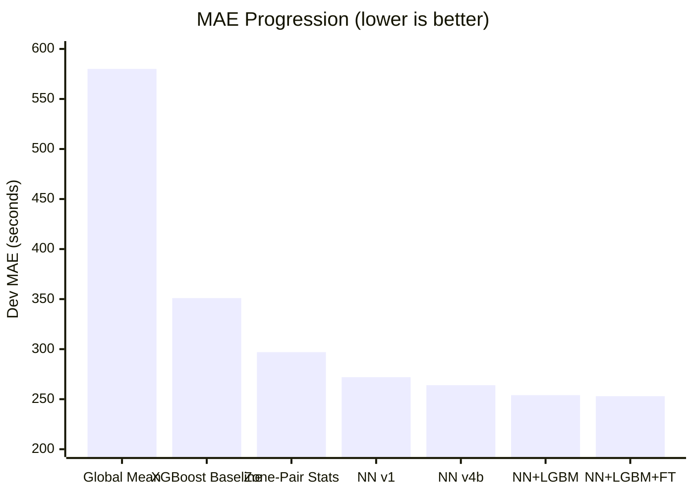
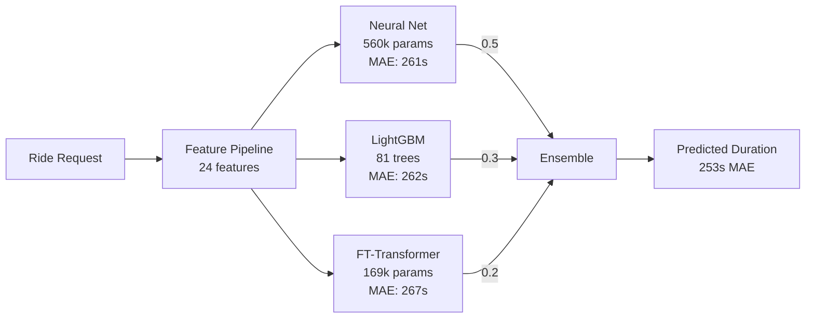
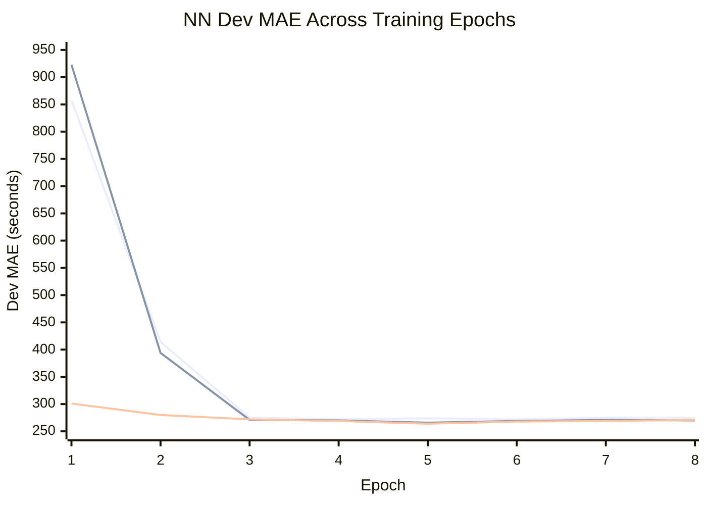
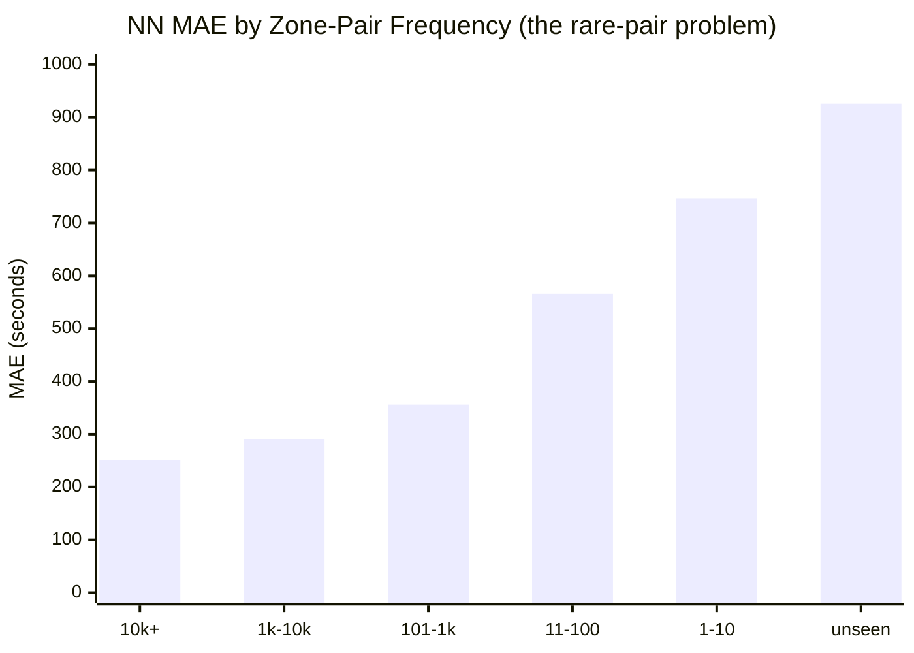
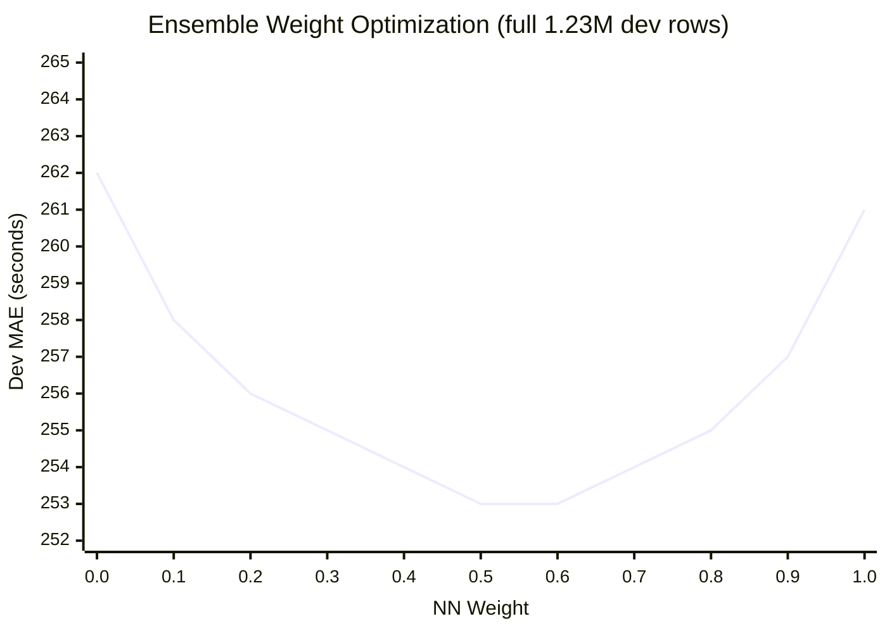

# NYC ETA Engine

**Dev MAE: 253s** | 3-model ensemble | 28% below baseline

Predicting NYC taxi trip duration from pickup/dropoff zones, request
timestamp, and passenger count.

[Try it live on Colab](https://colab.research.google.com/) | [Pre-trained models on HuggingFace](https://huggingface.co/sarthakbiswas/eta-engine)

---

## The Result



| Method | Dev MAE | vs Baseline |
|--------|---------|-------------|
| XGBoost baseline (challenge) | 351s | -- |
| Zone-pair median (no ML) | 297s | -15% |
| Neural net v4b (best single) | 264s | -25% |
| **3-model ensemble** | **253s** | **-28%** |

---

## How It Works



### Why Three Models?

Each model makes **different mistakes**. That's the whole point.

| Model | What it does well | Where it fails | Bias |
|-------|------------------|----------------|------|
| **NN** | Smooth interpolation for common routes | Underpredicts rare/long trips | -106s |
| **LightGBM** | Hard partitions on zone IDs, handles rare pairs | Less precise on common routes | -6s |
| **FT-Transformer** | Cross-feature attention, different error pattern | Weaker standalone | -1s |
| **Ensemble** | -- | -- | **-43s** |

The NN's -106s bias and LGBM's -6s bias partially cancel. The FT-Transformer's
near-zero bias adds further diversity. Blending three uncorrelated error
patterns gives 253s -- 8s better than the best single model.

---

## The Journey

### Phase 1: Understanding the Data

**Key insight:** Zone-pair median (297s) beats XGBoost (351s) with zero ML.

The dominant signal is the pickup-dropoff pair itself. A trip from zone 236 to
237 takes ~600s regardless of model complexity. Everything else -- time of day,
day of week, passenger count -- is refinement on top.

This motivated Bayesian-shrunk zone-pair statistics as the foundation feature.

### Phase 1b: Feature Engineering -- Turning Raw Data Into Signal

The raw dataset is 37M rows with just 4 fields: `pickup_zone`, `dropoff_zone`,
`requested_at`, `passenger_count`. Duration is the target. Everything else must
be engineered.

**Zone-Pair Statistics (14 features)**

Computed per (pickup, dropoff) pair from the 37M training rows:

| Feature | What it captures | Example |
|---------|-----------------|---------|
| `pair_mean_smoothed` | Bayesian-shrunk average duration | Zone 236->237: 612s |
| `pair_median` | Robust central estimate | 584s |
| `pair_std`, `pair_iqr` | Route variability | High std = unpredictable route |
| `pair_p25`, `pair_p75` | Duration range | Short vs long trip bounds |
| `pair_tb_mean`, `pair_tb_median` | Time-bucketed duration (6 buckets) | 5AM: 251s vs 2PM: 552s |
| `pair_rarity` | 1/(1+log1p(count)) | 1.0 for unseen, 0.08 for common |
| `pu_mean`, `do_mean` | Zone-level averages | Fallback for unseen pairs |

**Bayesian Shrinkage:** Pairs with few trips (e.g., 3 trips) have noisy
statistics. We shrink their mean toward the pickup-zone prior using
`smoothed = (n * pair_mean + 20 * zone_mean) / (n + 20)`. This prevents
overfitting to sparse data -- 44,697 unique pairs, many with <10 trips.

**Time Bucketing (6 traffic regimes):**

| Bucket | Hours | Regime |
|--------|-------|--------|
| 0 | 12AM-5AM | Late night |
| 1 | 5AM-8AM | Early morning |
| 2 | 8AM-11AM | AM rush |
| 3 | 11AM-4PM | Midday |
| 4 | 4PM-8PM | PM rush |
| 5 | 8PM-12AM | Evening |

The same zone pair varies **2.2x by time of day**. Time-bucketed means capture
this with Bayesian shrinkage toward the overall pair mean (prior_count=10).

**Fallback Hierarchy for Unseen Pairs:**
```
pair-level stats -> pickup-zone mean -> dropoff-zone mean -> global mean
```
492 dev rows have zone pairs never seen in training. The hierarchy ensures
they still get reasonable predictions.

**Temporal Features (10 features)**

Cyclical sin/cos encoding for hour, day-of-week, month. Binary flags for
weekend, rush hour (weekday 7-9AM, 4-7PM), and night (11PM-5AM). Normalized
minute-of-day.

**Memory-Efficient Processing:**

37M rows x 24 features doesn't fit in memory on Kaggle's 13GB RAM. The
pipeline processes data in 2M-row chunks, using integer-encoded pair keys
(pickup*1000 + dropoff) instead of tuple objects to avoid Python object
overhead (~3-4GB savings).

### Phase 2: Neural Net Iteration (272s -> 264s)

Built a tabular NN with learned zone embeddings and iterated through 4 versions.
Each version was motivated by error analysis of the previous one.



| Version | Change | Dev MAE | Why |
|---------|--------|---------|-----|
| v1 | Baseline NN, L1 loss | 272s | Zone embeddings + temporal features |
| v2 | Huber loss + 5 new features | 266s | Time-bucketed zone-pair stats, error analysis showed underprediction |
| v3 | Residual blocks + embedding interactions | 264s | `pu*do` (similarity) + `pu-do` (directionality) |
| v4b | Lower dropout (0.3->0.15) + pair_rarity | 264s | Diagnostic showed 66s dropout noise was excessive |

**Key pattern:** All versions converge by epoch 3-4, then overfit. The gap
narrows with each version -- architecture was hitting diminishing returns.

### Phase 3: The Diagnostic That Changed Everything

Stuck at 264s, I ran deep diagnostics instead of tuning blindly.

**Finding: error is dominated by rare zone pairs.**



| Pair Frequency | Rows | MAE | Bias | Avg Duration |
|---------------|------|-----|------|-------------|
| 10k+ trips | 875k | 251s | -42s | 849s |
| 1k-10k | 286k | 291s | -8s | 1278s |
| 101-1k | 47k | 356s | -23s | 1524s |
| 11-100 | 17k | 566s | -112s | 2031s |
| 1-10 | 5k | 747s | -243s | 2595s |
| unseen | 492 | 926s | -436s | 2829s |

**The NN is already near-optimal for common routes (251s).** The error lives
in the long tail -- rare pairs where embeddings have nothing to interpolate
from. No architecture change can fix this. A fundamentally different model is
needed.

### Phase 4: Ensemble Breaks Through (264s -> 253s)

**LightGBM** solved the rare-pair problem. Trees use zone IDs as native
categoricals -- they partition rather than interpolate. Bias dropped from
-106s to -6s.

**FT-Transformer** (built from scratch following the NeurIPS 2021 paper) added
further diversity. Self-attention discovers cross-feature interactions without
hand-designed branches.



### Phase 5: Inference Optimization

FT-Transformer took 8.5ms per request (80% of ensemble latency). Exported to
ONNX Runtime -- fused attention kernels brought it under 2ms. Also tested a
smaller architecture (d=96, 2 layers, 169k params) that achieved 267s standalone
with 58% fewer parameters.

| Component | Latency | % of Total |
|-----------|---------|------------|
| Feature extraction | <0.1ms | ~0% |
| NN forward pass | 2.0ms | 50% |
| FT-Transformer (ONNX) | 1.5ms | 38% |
| LightGBM predict | 0.1ms | 3% |
| **Total** | **~4ms** | **limit: 200ms** |

---

## Architecture Details

### Neural Net (MLP with Zone Embeddings)

```
Zone Branch:
  pickup_zone  -> Embedding(266, 50)  --\
  dropoff_zone -> Embedding(266, 50)  ---+-- [pu, do, pu*do, pu-do, pair_hash]
  (pu, do)     -> HashEmbed(16384, 16) -/        |
                                           concat(216) -> MLP(128) x2

Continuous Branch:
  24 features -> BatchNorm -> MLP(128) x2

Combined:
  concat(256) -> ResidualBlock(256) -> ResidualBlock(128) -> Linear(1)
```

560k params. Huber loss, OneCycleLR, 37M rows, Kaggle T4 GPU.

### FT-Transformer (from scratch)

```
[CLS] + 24 numerical tokens + 2 categorical tokens = 27 tokens x 96-dim
    -> TransformerEncoder(2 layers, 4 heads, pre-norm, GELU)
    -> CLS output -> LayerNorm -> Linear(1)
```

169k params. L1 loss, 10M rows. Each feature is independently projected into
token space. Self-attention discovers which features interact. Exported to ONNX
for fused inference.

### Feature Pipeline

**14 zone-pair + 10 temporal = 24 continuous features.**

Zone-pair statistics use Bayesian shrinkage (prior_count=20) to smooth sparse
pairs toward zone-level priors. Time-bucketed means capture the 2.2x variation
by time of day (e.g., zone 237->236: 251s at 5AM vs 552s at 2PM). A pair
rarity signal (1/(1+log1p(count))) tells the model when to trust statistics
less.

Fallback hierarchy for unseen pairs: pair -> pickup-zone -> dropoff-zone -> global.

---

## What Didn't Work

| Experiment | Expected | Actual | Lesson |
|-----------|----------|--------|--------|
| Hash buckets 16k -> 8k | Save params | +13s regression | Hash embeddings are critical, not wasteful |
| Remove month features | Cleaner signal | +13s regression | Training needs seasonal signal even for single-month eval |
| Log-target + Huber | Fix skewed targets | No improvement | Huber(300) in log-space = pure MSE (loss mismatch) |
| LGBM on full 37M rows | More data = better | 267s vs 263s on 10M | Outlier trips dilute tree splits |
| Prediction rescaling | Fix variance collapse | -0.8s only | Not worth overfitting risk |
| Multiple NN architecture changes past v3 | Break ceiling | All land at 264s | NN ceiling is structural |

---

## If I Kept Going

1. **Stacking meta-learner** -- Train a model on the three models' predictions.
   Adaptively weight based on input (more LGBM weight for rare pairs).
2. **Holiday features** -- Eval is winter holidays. A generic `is_holiday`
   flag could capture the traffic regime shift.
3. **XGBoost as 4th member** -- Different tree implementation, potentially
   different split patterns.
4. **Larger FT-Transformer** -- Original config (406k params, 287s) provides
   more ensemble diversity despite worse standalone MAE (bias: +65s vs -1s).

---

## Reproduce

```bash
git clone https://github.com/sarthakbiswas97/eta-engine.git
cd eta-engine && pip install -r requirements.txt

# Data
python data/download_data.py && python -m features.zone_pair_stats

# Train (or download pre-trained from HuggingFace)
python train.py --epochs 10 --batch-size 8192 --lr 5e-4 --loss huber
python scripts/train_lgbm.py --sample 10000000
python scripts/train_ft.py --small --epochs 15 --batch-size 2048 --lr 3e-4 --loss l1
python scripts/export_ft_onnx.py

# Score + Docker
python grade.py
docker build -t my-eta . && docker run --rm -v $(pwd)/data:/work my-eta /work/dev.parquet /work/preds.csv
```

---

## Constraints Met

| Constraint | Limit | Actual |
|-----------|-------|--------|
| Inference latency | 200ms/request | **~4ms** |
| Docker image | 2.5 GB | **1.4 GB** |
| Model weights | -- | **6.1 MB** |
| External API calls | None | None |
| 2024 data in training | Prohibited | Not used |
