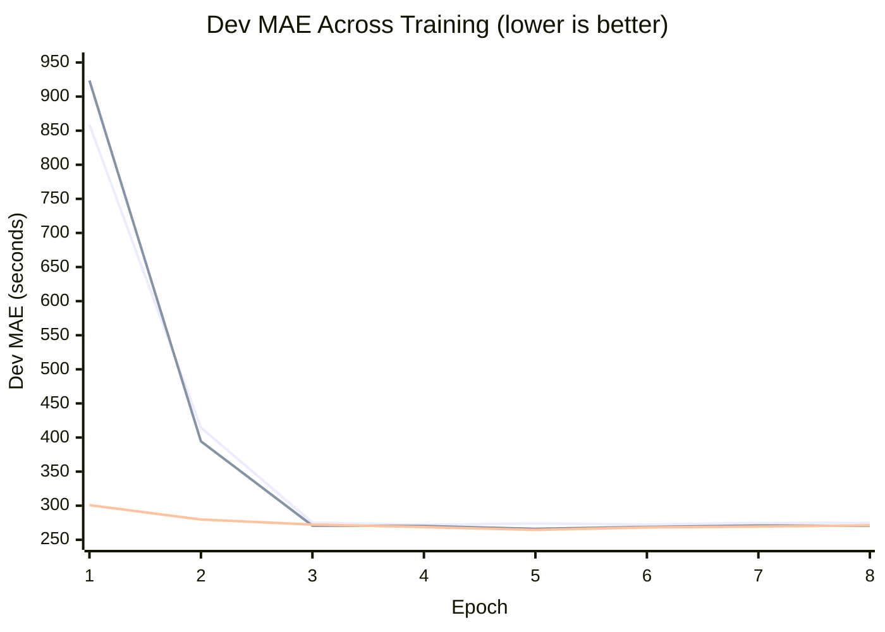

# NYC ETA Engine

Predicting NYC taxi trip duration from pickup/dropoff zones, request
timestamp, and passenger count. Built for the Gobblecube ETA Challenge.

See [CHALLENGE.md](CHALLENGE.md) for the original problem statement and rules.

---

## Approach

### Problem

Given a ride request (pickup zone, dropoff zone, timestamp, passenger count),
predict trip duration in seconds. Scored on MAE against a held-out 2024
winter-holiday eval set.

### Design Philosophy

The model is **generic** -- it learns all spatial relationships from the trip
data itself via embeddings, not from external geography (no shapefiles, no
hardcoded coordinates). If the zone IDs mapped to a different city, the model
would learn equally well given the same trip patterns.

### Architecture: 3-Model Ensemble

Three models with complementary strengths, weighted at inference:

```
pred = 0.6 * NN + 0.2 * LightGBM + 0.2 * FT-Transformer
```

**Model 1: Tabular Neural Net (560k params, 2.3 MB)**

```
Zone Branch:
  pickup_zone  -> Embedding(266, 50)  --\
  dropoff_zone -> Embedding(266, 50)  ---+-- [pu, do, pu*do, pu-do, pair_hash]
  (pu, do)     -> HashEmbed(16384, 16) -/        |
                                           concat(216) -> MLP(128) x2 -> 128-dim

Continuous Branch:
  24 features -> BatchNorm(24) -> MLP(128) x2 -> 128-dim

Combined:
  concat(256) -> ResidualBlock(256)
             -> project(128) -> ResidualBlock(128)
             -> Linear(64) -> SiLU -> Linear(1)
```

Trained on full 37M rows with Huber loss, OneCycleLR, Kaggle T4 GPU. Best at
smooth interpolation for common routes. Systematic underprediction bias
(-106s) on rare/long trips.

**Model 2: LightGBM (81 trees, 2.4 MB)**

Gradient-boosted tree on same 24 features + zone IDs as native categoricals.
Trained on 10M rows with MAE objective. Near-zero bias (-6s) because trees
partition the feature space directly rather than interpolating through
embeddings. Complements the NN on rare zone pairs.

**Model 3: FT-Transformer (406k params, 1.6 MB)**

Feature Tokenizer Transformer (Gorishniy et al., NeurIPS 2021), implemented
from scratch. Each feature is projected into a 128-dim token; a [CLS] token
aggregates information via 3-layer self-attention. Captures cross-feature
interactions that the MLP's hand-designed branches miss.

```
24 numerical features -> NumericalTokenizer (24 independent Linear(1,128))
2 zone IDs            -> CategoricalTokenizer (2 independent Embedding(266,128))
[CLS]                 -> learnable parameter

[CLS, feat_0, ..., feat_25] = 27 tokens x 128-dim
    -> TransformerEncoder(3 layers, 8 heads, pre-norm, GELU)
    -> CLS output -> LayerNorm -> Linear(128, 1)
```

Trained on 10M rows with L1 loss. Positive bias (+65s) offsets the NN's
negative bias, improving ensemble diversity.

**Why ensemble works:**

| Model | Dev MAE | Bias | Strength |
|-------|---------|------|----------|
| NN | 261.2s | -106s | Precision on common routes |
| LGBM | 261.7s | -6s | Rare pairs, low bias |
| FT | 284.7s | +65s | Different error pattern, bias offset |
| **Ensemble** | **252.7s** | **-42s** | **Best of all three** |

Error correlation between NN and LGBM: 0.938 (moderate decorrelation).
Combined inference: <5ms per request on CPU.

**Feature groups (26 total):**

1. **Zone-pair statistics (14 features)** -- precomputed mean, median, std,
   p25, p75, IQR, trip count per (pickup, dropoff) pair with Bayesian
   shrinkage for sparse pairs. Time-bucketed mean/median (6 time-of-day
   buckets). Pair rarity signal for rare-pair awareness. Fallback hierarchy:
   pair -> pickup-zone -> dropoff-zone -> global.
2. **Temporal features (10 features)** -- cyclical sin/cos encoding for hour,
   day-of-week, month. Binary flags for weekend, rush hour, night. Normalized
   minute-of-day.
3. **Zone embeddings (2 categorical)** -- separate learned embeddings for
   pickup and dropoff zones (dim=50 each), plus element-wise product
   (similarity) and difference (directionality), plus a hash-based zone-pair
   embedding (16k buckets, dim=16).

---

## Results

| Method | Dev MAE | Notes |
|--------|---------|-------|
| Predict global mean | ~580 s | -- |
| XGBoost baseline (6 features) | 351.0 s | Challenge baseline |
| Zone-pair smoothed mean | 302.7 s | Statistics only |
| Zone-pair median | 296.7 s | Statistics only |
| Zone-pair time-bucketed mean | 277.9 s | Statistics only |
| Neural net v1 (L1, 19 features) | 272.1 s | 372k params |
| Neural net v2 (Huber, 24 features) | 266.2 s | +temporal zone-pair stats |
| Neural net v3 (residual, Huber) | 264.5 s | +embedding interactions |
| Neural net v4b | 264.3 s | Lower dropout, pair_rarity |
| LightGBM (81 trees, MAE) | 263.1 s | 10M rows, 2.4 MB |
| FT-Transformer (L1, 10M rows) | 287.1 s | 406k params, attention-based |
| NN + LightGBM (2-model) | 254.0 s | alpha=0.50/0.50 |
| **NN + LGBM + FT (3-model)** | **252.7 s** | **0.60/0.20/0.20, -28% vs baseline** |

---

## Experiments

### v1: Baseline Neural Net

**What:** Tabular neural net with separate zone embedding and continuous
feature branches, combined MLP, L1 loss. 19 continuous features (8 zone-pair
stats + 11 temporal). 372k parameters.

**Why:** Zone-pair median alone (296.7s) beats XGBoost (351s), so the dominant
signal is the pickup-dropoff pair. A neural net can learn nonlinear
interactions between zone embeddings and temporal features that simple
statistics miss.

**Result:** 272.1s (epoch 4, early stopped at 7). Error analysis revealed
systematic underprediction on long trips (-970s bias for 2400s+ trips).

---

### v2: Temporal Features + Huber Loss

**What changed:** 5 new features (temporal zone-pair mean/median, pair IQR,
log count, same-zone flag) + Huber loss (delta=300).

**Why:** Same zone pair varies 2.2x by time of day. Huber addresses long-trip
underprediction bias.

**Result:** 266.2s (epoch 5). 6s improvement, but architecture plateau.

---

### v3: Residual Architecture + Embedding Interactions

**What changed:** Element-wise product/difference of zone embeddings, deeper
zone MLP, residual blocks in combined MLP, wider continuous branch. 372k ->
560k params.

**Why:** v2 plateaued at 266s despite strong features -- architecture was the
bottleneck.

**Result:** 264.5s (epoch 5). 1.7s improvement. Confirmed diminishing returns
on architecture changes alone.

---

### v4: Diagnostic-Driven Tuning

**What:** Deep diagnostic analysis (parameter health, rare-pair behavior,
feature sparsity, regularization effectiveness). Led to:
- Lower dropout (0.3 -> 0.15): reduced 66s prediction noise
- pair_rarity feature: signals when zone-pair stats are unreliable
- Confirmed NN ceiling at ~264s

**Failed experiments:**
- Hash bucket reduction (16k -> 8k): 13s regression
- Month feature removal: 13s regression (training needs seasonal signal)
- Log-target + Huber: loss/metric mismatch in log-space

---

### Ensemble: Breaking the NN Ceiling

**Insight:** Diagnostic showed NN's -106s bias was driven by rare zone pairs
(MAE 400-926s for pairs with <100 training trips). No amount of NN tuning
could fix this -- embeddings interpolate, and rare pairs have nothing to
interpolate from.

**LightGBM** solved this: trees use zone IDs as native categoricals, partitioning
the space directly. Bias dropped from -106s to -6s.

**FT-Transformer** added further diversity: its positive bias (+65s) partially
offsets the NN's negative bias, and self-attention discovers cross-feature
interactions without hand-designed branches.

**Ensemble optimization:** Grid search over weights on full 1.23M dev set.
Best: NN=0.6, LGBM=0.2, FT=0.2.

---

### Learning Curves



---

## Project Structure

```
.
├── CHALLENGE.md              # Original challenge README (reference)
├── SUBMISSION_TEMPLATE.md    # Submission writeup
├── baseline.py               # Original XGBoost baseline (reference)
├── predict.py                # Submission interface (3-model ensemble)
├── grade.py                  # Local scoring harness
├── train.py                  # MLP training script (GPU, MLflow)
├── Dockerfile                # Submission packaging
├── requirements.txt          # Python dependencies
├── model.pt                  # Trained MLP weights (560k params)
├── lgbm_model.txt            # Trained LightGBM (81 trees)
├── ft_model.pt               # Trained FT-Transformer (406k params)
├── features/                 # Feature engineering modules
│   ├── zone_pair_stats.py    # Zone-pair statistics with Bayesian shrinkage
│   ├── temporal.py           # Temporal feature extraction
│   └── pipeline.py           # Unified feature pipeline
├── model/                    # Model architectures
│   ├── architecture.py       # ETAModel (MLP with embeddings)
│   ├── ft_transformer.py     # FT-Transformer (from scratch)
│   └── dataset.py            # PyTorch Dataset/DataLoader
├── scripts/                  # Training and analysis scripts
│   ├── train_lgbm.py         # LightGBM training
│   ├── train_ft.py           # FT-Transformer training
│   ├── find_ensemble_weight.py  # Ensemble weight optimization
│   ├── find_rescaling.py     # Prediction rescaling analysis
│   ├── train_dev_gap.py      # Train vs dev gap analysis
│   ├── diagnose.py           # Model diagnostics
│   └── upload_data_hf.py     # Push data to HF Hub
├── notebooks/
│   └── train_gpu.ipynb       # Colab/Kaggle training notebook
├── data/
│   ├── download_data.py      # Fetches NYC TLC data
│   ├── schema.md             # Data schema documentation
│   └── zone_pair_stats/      # Generated artifacts (gitignored)
└── tests/
    └── test_submission.py    # Smoke tests for submission contract
```

---

## Setup

```bash
python -m venv .venv && source .venv/bin/activate
pip install -r requirements.txt

# Download data (~500 MB, one-time)
python data/download_data.py

# Compute zone-pair stats
python -m features.zone_pair_stats

# Train all three models (GPU recommended, or use notebooks/train_gpu.ipynb)
python train.py --epochs 10 --batch-size 8192 --lr 5e-4 --loss huber --run-name v4b
python scripts/train_lgbm.py --sample 10000000 --run-name lgbm-v1
python scripts/train_ft.py --sample 10000000 --epochs 15 --batch-size 2048 --lr 3e-4 --loss l1 --run-name ft-v3

# Score on dev set (uses ensemble predict.py)
python grade.py

# Docker build and test
docker build -t my-eta .
docker run --rm -v $(pwd)/data:/work my-eta /work/dev.parquet /work/preds.csv
```

---

## What Worked

- **3-model ensemble (biggest win):** NN + LightGBM + FT-Transformer. Each
  model has a different inductive bias (embeddings vs tree splits vs
  attention). Ensemble reduced MAE from 261s to 253s.
- **Zone-pair statistics as features:** Zone-pair median alone (296.7s) beats
  XGBoost (351s) with zero ML. Bayesian shrinkage handles sparse pairs.
- **LightGBM with native categoricals:** Trees handle zone IDs directly.
  Near-zero bias (-6s) on rare pairs where NN struggles (-106s bias).
- **FT-Transformer from scratch:** Self-attention discovers cross-feature
  interactions automatically. Positive bias (+65s) offsets NN's negative bias.
- **Deep diagnostics before tuning:** Parameter health, rare-pair analysis,
  and regularization checks revealed the true bottleneck (rare-pair bias) and
  prevented wasted experiments on architecture changes.
- **Element-wise embedding interactions:** Product captures zone similarity,
  difference captures trip directionality.
- **Chunked data processing:** 37M rows in 2M chunks keeps memory under 6GB,
  enabling training on free-tier Kaggle (13GB RAM).
- **MLflow experiment tracking:** All runs logged with hyperparameters,
  metrics, and artifacts.

## What Didn't Work

- **Reducing hash buckets (16k -> 8k):** 13s regression. Hash embeddings at
  47% of params are critical.
- **Removing month features:** 13s regression. Training data needs seasonal
  signal even when eval is a single month.
- **Log-target + Huber loss:** Huber(delta=300) in log-space is pure MSE.
  Loss/metric mismatch.
- **LGBM on full 37M rows:** Worse than 10M subsample. More data included
  more outlier trips that diluted tree splits.
- **Prediction rescaling/bias correction:** Only -0.8s gain. Not worth the
  overfitting risk on eval.
- **FT-Transformer with MSE loss:** 293s vs 287s with L1. Loss/metric
  mismatch again (eval is MAE, train should match).

---

## Constraints

- Inference: <= 200 ms per request on CPU (actual: <5 ms for 3-model ensemble)
- Docker image: <= 2.5 GB (estimated: ~500 MB)
- Total model weights: 6.3 MB (2.3 + 2.4 + 1.6)
- No external API calls at inference time
- No 2024 data in training
